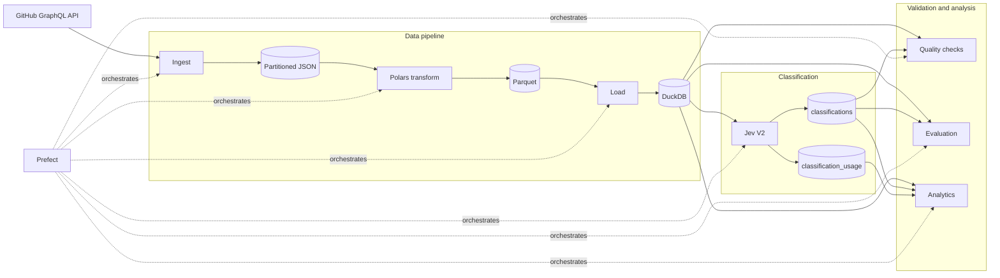
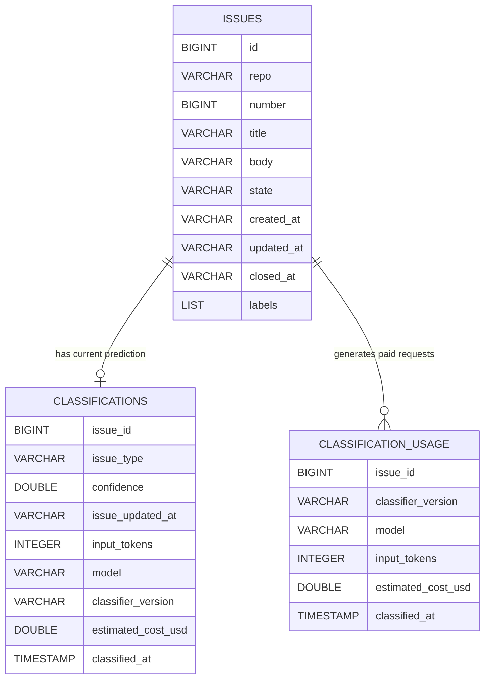

# IssueFlow

IssueFlow is a cost-aware data pipeline for collecting, transforming, classifying, validating, and analyzing GitHub issues.

It began as a small pipeline over roughly 500 FastAPI issues. As the dataset grew, the design changed with it: REST pagination was replaced with GraphQL cursor pagination, raw data was partitioned by repository, analytical storage moved through Parquet into DuckDB, classifier evaluation moved beyond noisy GitHub labels to a reviewed holdout set, and paid model usage gained explicit token and cost controls.

The current dataset contains **100,000 issues from five open-source repositories**.

## Results

| Metric | Result |
| --- | ---: |
| Issues collected | **100,000** |
| Repositories | **5** |
| Reviewed reference set | **400 issues** |
| Held-out test set | **101 issues** |
| Held-out accuracy | **86.1%** |
| 4-class macro F1 | **0.869** |
| Semantic classes | bug, feature, docs, question, other |
| Analytical storage | Parquet + DuckDB |
| Orchestration | Prefect |
| CI | pytest + GitHub Actions |

The reported classifier metrics come from the reviewed holdout experiment. The main pipeline also contains a separate lightweight agreement check against repository labels.

---

## Quick Start

Requirements:

- Python 3.14+
- [`uv`](https://docs.astral.sh/uv/)
- GitHub API token
- TypeSafe/Jev API key

Create a `.env` file:

```env
GITHUB_TOKEN=...
TYPESAFE_API_KEY=...
```

Install dependencies:

```bash
uv sync
```

Run the complete pipeline:

```bash
uv run flow.py
```

Run tests:

```bash
uv run pytest
```

The main flow executes:

```text
ingest
  ↓
transform
  ↓
load
  ↓
classify
  ↓
quality
  ↓
evaluate
  ↓
analytics
```

Individual stages can also be run directly:

```bash
uv run src/issueflow/ingest.py
uv run src/issueflow/transform.py
uv run src/issueflow/load.py
uv run src/issueflow/classify.py
uv run src/issueflow/quality.py
uv run src/issueflow/evaluate.py
uv run src/issueflow/analytics.py
```

---

## Architecture



The pipeline deliberately separates raw ingestion, transformation, analytical storage, model inference, validation, and reporting.

---

## Data Flow

```text
GitHub GraphQL API
        │
        ▼
data/raw/<repository>/
Partitioned JSON batches
        │
        ▼
      Polars
        │
        ▼
data/issues.parquet
        │
        ▼
      DuckDB
        │
        ├── issues
        ├── classifications
        └── classification_usage
        │
        ├── data quality
        ├── evaluation
        └── analytics
```

Raw API data is preserved before transformation. This allows downstream processing to run without requesting the same source data again.

---

## Dataset

IssueFlow collects data from five repositories.

| Repository | Issues |
| --- | ---: |
| `microsoft/vscode` | 50,000 |
| `kubernetes/kubernetes` | 20,000 |
| `pytorch/pytorch` | 20,000 |
| `tensorflow/tensorflow` | 6,447 |
| `fastapi/fastapi` | 3,553 |
| **Total** | **100,000** |

Per-repository limits prevent a single project from consuming the entire dataset.

Raw files are partitioned by repository:

```text
data/raw/
├── fastapi_fastapi/
├── microsoft_vscode/
├── kubernetes_kubernetes/
├── pytorch_pytorch/
└── tensorflow_tensorflow/
```

Each directory contains batches of GitHub issues stored as JSON.

---

## Database Model

DuckDB contains three logical datasets used by the main pipeline.



These are logical relationships used by the pipeline; the current DuckDB schema does not rely on foreign-key enforcement.

### `issues`

The analytical representation of the GitHub dataset.

One row represents one GitHub issue and contains its repository, issue number, content, state, timestamps, and labels.

### `classifications`

Stores the current semantic prediction for an issue.

Alongside the predicted class and confidence, it stores the source issue update timestamp. That timestamp allows IssueFlow to detect when an existing prediction has become stale.

### `classification_usage`

Stores paid inference usage separately from current classifier state.

Each request records its input tokens and estimated cost. Replacing a prediction therefore does not erase the cost of producing an earlier one.

---

## Repository Structure

```text
issueflow/
├── .github/
│   └── workflows/
│       └── test.yml
│
├── src/
│   └── issueflow/
│       ├── __init__.py
│       ├── ingest.py
│       ├── transform.py
│       ├── load.py
│       ├── classify.py
│       ├── quality.py
│       ├── evaluate.py
│       └── analytics.py
│
├── scripts/
│   ├── build_eval_set.py
│   ├── semantic_inspect_labels.py
│   ├── run_eval_baseline.py
│   ├── run_eval_v2.py
│   ├── run_eval_v3.py
│   ├── evaluate_baseline.py
│   ├── evaluate_v2.py
│   ├── evaluate_gold.py
│   ├── evaluate_holdout.py
│   ├── compare_v2_v3_dev.py
│   ├── export_gold_review.py
│   ├── split_gold.py
│   └── ...
│
├── tests/
│   └── test_quality.py
│
├── data/                  # generated locally, ignored by Git
│   ├── raw/
│   ├── issues.parquet
│   └── issueflow.duckdb
│
├── flow.py
├── pyproject.toml
├── uv.lock
└── README.md
```

The directory responsibilities are intentionally separated:

- `src/issueflow/` — production pipeline stages
- `scripts/` — dataset inspection and classifier experiments
- `tests/` — automated checks
- `data/` — generated raw and analytical data
- `flow.py` — Prefect orchestration entry point

---

# How the System Evolved

IssueFlow was built iteratively. The current architecture is the result of constraints encountered while increasing scale, evaluation quality, and reliability.

## 1. Grounding the Pipeline

### Situation

The first version used roughly 500 issues from `fastapi/fastapi`.

The immediate problem was not scale. It was proving that the complete path worked:

```text
GitHub
→ ingest
→ transform
→ store
→ classify
→ evaluate
→ analyze
```

### Task

Build the smallest end-to-end pipeline before introducing scaling infrastructure.

### Action

The first implementation added:

- GitHub API ingestion
- raw JSON storage
- Polars transformations
- DuckDB
- SQL analytics
- Jev classification
- Prefect orchestration

### Result

The whole workflow could be executed through one entry point:

```bash
uv run flow.py
```

That became the baseline for every later change.

---

## 2. Scaling Beyond REST Pagination

### Situation

The small pipeline worked, so ingestion was expanded toward a 100,000-issue dataset.

The initial implementation used GitHub REST pagination.

At deeper pages, the approach eventually hit:

```text
422 Unprocessable Entity
```

The original pagination strategy could not reliably traverse enough repository history.

### Task

Collect a much larger dataset while supporting multiple repositories and avoiding duplicate storage.

### Action

Ingestion moved to the GitHub GraphQL API.

Numbered pages were replaced with cursor pagination:

```text
first: 100
after: null
      │
      ▼
 endCursor
      │
      ▼
first: 100
after: endCursor
      │
      ▼
   repeat
```

Raw data was also split into repository-specific JSON batches.

Before writing a batch, IssueFlow loads existing issue IDs and skips records already stored.

Repository-level limits control how much each source contributes.

### Result

The ingestion layer reached:

```text
100,000 unique issues
```

across five repositories while keeping the raw dataset partitioned and restart-friendly.

---

## 3. Separating Raw and Analytical Data

### Situation

Raw JSON was useful for retaining source records but awkward for analytical queries.

The pipeline needed efficient scans, aggregation, joins, and repeatable transformations.

### Task

Build an analytical layer without adding unnecessary server infrastructure.

### Action

The storage path became:

```text
JSON
  ↓
Polars
  ↓
Parquet
  ↓
DuckDB
```

Polars normalizes repository batches into one tabular dataset:

```text
data/issues.parquet
```

DuckDB then loads the Parquet data into the `issues` table for SQL-based processing.

### Result

Raw source data remains available while analytics operate on a compact columnar representation.

---

## 4. Discovering That GitHub Labels Were Noisy

### Situation

The first classifier was evaluated using GitHub labels as the reference.

That produced roughly:

```text
72% agreement
```

Inspecting mismatches showed that many apparent classifier errors were actually label-semantic mismatches.

Different repositories use labels for different purposes:

- semantic category
- triage state
- subsystem ownership
- workflow status
- migration state

A documentation problem could therefore carry a feature label, while a software defect could appear under a question-oriented label.

### Task

Separate semantic classification quality from repository-specific labeling conventions.

### Action

Repository labels were mapped into common weak semantic classes:

```text
bug
feature
docs
question
```

A balanced evaluation set was created and classifier errors were inspected manually.

The weak labels remained useful for bootstrapping analysis, but they were no longer treated as reliable final ground truth.

### Result

The project moved from measuring repository-label agreement to evaluating against a reviewed reference set.

---

## 5. Building a Reviewed Benchmark

### Situation

Optimizing directly against noisy GitHub labels risked improving label agreement without improving the actual classification task.

### Task

Create a more reliable evaluation process and keep final evaluation separate from classifier iteration.

### Action

A reviewed reference set of **400 issues** was created.

It was split into:

```text
299 development examples
101 held-out test examples
```

The development portion was used for error analysis and classifier iteration.

The holdout portion was kept separate until the classifier choice was finalized.

### Result

Jev V2 achieved the following results on the held-out set:

```text
Accuracy:         86.1%
4-class macro F1: 0.869
```

| Class | Precision | Recall | F1 |
| --- | ---: | ---: | ---: |
| Bug | 0.912 | 0.816 | 0.861 |
| Feature | 0.833 | 1.000 | 0.909 |
| Docs | 1.000 | 0.864 | 0.927 |
| Question | 0.727 | 0.842 | 0.780 |

The four-class macro F1 covers the primary classes. The holdout contained only two reviewed `other` examples, so `other` is not included in that aggregate.

---

## 6. Rejecting V3

### Situation

Error analysis showed that V2 still missed some true bugs by classifying them as questions.

A V3 criteria set was created to make the classifier more sensitive to concrete broken behavior.

### Task

Determine whether increased bug recall improved the classifier overall.

### Action

V2 and V3 were evaluated on the same development set.

V3 increased bug recall, but it also moved too many questions into the bug class.

Overall accuracy and macro F1 decreased.

### Result

V3 was rejected.

V2 remained the selected classifier.

The experiment is kept in `scripts/` because a model change is only accepted when evaluation supports it.

---

## 7. Making Classification Incremental

### Situation

Running model inference over every issue on every execution would waste API calls, time, and money.

Issues can also change after classification.

### Task

Reclassify only records whose prediction is missing or no longer valid.

### Action

Before calling Jev, the classifier compares issues with stored classifications.

An issue is eligible when:

```text
no classification exists
OR
the source issue changed
OR
the classifier version changed
```

The source `updated_at` value is stored alongside each prediction.

### Result

Repeated runs reuse valid predictions and process only missing or stale classifications.

---

## 8. Making Model Cost Part of the Pipeline

### Situation

A model call that is inexpensive individually becomes meaningful when multiplied across tens of thousands of records.

The full dataset therefore introduced a second scaling constraint:

```text
records
   ↓
model requests
   ↓
input tokens
   ↓
cost
```

### Task

Prevent a large run from consuming API credit without a defined limit.

### Action

Each Jev response contributes usage data to `classification_usage`.

The pipeline tracks:

```text
input_tokens
estimated_cost_usd
model
classifier_version
classified_at
```

Before another request is sent, cumulative recorded cost is checked against the classifier's hard budget guard.

The authoritative budget and token-price settings live in:

```text
src/issueflow/classify.py

MAX_RUN_COST_USD
PRICE_PER_MILLION_INPUT_TOKENS
BUDGET_RESERVE_USD
```

Completed predictions are written continuously, so a stopped run can continue later without repeating successful work.

### Result

Cost became observable and bounded instead of being an external side effect of classification.

---

## 9. Turning Data Assumptions Into Checks

### Situation

A pipeline can complete successfully while still producing invalid data.

Potential failures include:

- duplicate issues
- incomplete records
- invalid states
- dangling classifications
- duplicate predictions
- invalid classes
- invalid confidence values
- predictions based on outdated issue content

### Task

Make those assumptions executable.

### Action

A dedicated quality stage validates:

```text
Duplicate issue IDs
Missing required issue fields
Invalid issue states
Classification IDs missing from issues
Duplicate classification issue IDs
Invalid V2 classes
Invalid V2 confidence values
Stale V2 classifications
```

A failed check exits with a non-zero status.

### Result

Invalid data stops the Prefect flow before downstream evaluation and analytics continue.

---

## 10. Adding Automated Tests and CI

### Situation

Quality rules are useful only if changes to the project do not silently break them.

### Task

Automatically verify important valid and invalid cases.

### Action

The pytest suite currently covers quality behavior including:

- valid data passing
- invalid issue states failing
- stale classifications failing

GitHub Actions runs:

```bash
uv run pytest
```

for pushes and pull requests.

### Result

Core data-quality behavior is continuously checked as the repository changes.

---

## 11. Adding Operational Visibility

### Situation

As the flow gained more stages, a final success or failure message was not enough to understand what happened.

### Task

Expose execution behavior and pipeline state.

### Action

Prefect provides task state, retries, and stage-level execution timing.

The analytics stage reports:

- classification coverage
- cumulative input tokens
- estimated classifier cost
- predicted class distribution
- average confidence by class
- open vs closed issue counts
- low-confidence prediction count
- lowest-confidence examples

### Result

A pipeline run reports not only whether it completed, but also how much data was processed and how the classifier behaved.

---

## Classification

The selected classifier uses five possible outputs:

| Class | Meaning |
| --- | --- |
| `bug` | Confirmed defect, regression, or behavior different from what is expected |
| `feature` | Request for new functionality, capability, behavior, or improvement |
| `docs` | Missing, incorrect, unclear, or outdated documentation |
| `question` | Usage, configuration, or informational request without a clear software defect |
| `other` | Issue that does not clearly match the other categories |

The current production criteria are defined in:

```text
src/issueflow/classify.py
```

Classifier experiments and comparisons live separately under:

```text
scripts/
```

This keeps experimental evaluation out of the production flow.

---

## Evaluation

IssueFlow uses two different evaluation paths for different purposes.

### Pipeline agreement check

`src/issueflow/evaluate.py` performs a lightweight comparison between classifications and issues whose GitHub labels exactly match one of the simple semantic labels.

This is useful as an operational signal, but repository labels are not treated as reviewed ground truth.

### Reviewed evaluation

The experimental scripts under `scripts/` contain the reviewed evaluation workflow:

```text
weak-label inspection
        ↓
balanced evaluation set
        ↓
reviewed reference set
        ↓
development / holdout split
        ↓
V2 / V3 comparison
        ↓
held-out evaluation
```

The final reported classifier metrics come from the held-out reviewed set, not from the pipeline's GitHub-label agreement calculation.

---

## Data Quality

Run quality checks directly with:

```bash
uv run src/issueflow/quality.py
```

Typical successful output:

```text
Data quality checks

PASS  Duplicate issue IDs
PASS  Missing required issue fields
PASS  Invalid issue states
PASS  Classification IDs missing from issues
PASS  Duplicate classification issue IDs
PASS  Invalid V2 classes
PASS  Invalid V2 confidence values
PASS  Stale V2 classifications

Classification coverage
...

All quality checks passed
```

Any failed invariant returns a non-zero exit code.

---

## Analytics

Run analytics directly with:

```bash
uv run src/issueflow/analytics.py
```

The stage reports:

```text
Classification coverage
Token usage
Estimated cost
Issue count by class
Average confidence by class
Open vs closed
Low-confidence predictions
Lowest-confidence examples
```

These outputs make partial classification and uncertain predictions visible rather than silently treating them as complete results.

---

## Design Choices

| Technology | Responsibility | Reason |
| --- | --- | --- |
| Python | Pipeline implementation | Shared ecosystem for APIs, data processing, testing, and AI integration |
| GitHub GraphQL API | Source ingestion | Cursor-based traversal for large repository histories |
| HTTPX | API client | Used for GitHub and Jev HTTP requests |
| Polars | Transformation | Columnar batch processing for normalized issue data |
| Parquet | Intermediate dataset | Compact columnar storage that integrates directly with analytical tools |
| DuckDB | Analytical database | Local SQL engine suited to scans, joins, and aggregation |
| Jev | Semantic classification | Structured probabilistic classification with confidence and usage information |
| Prefect | Orchestration | Task boundaries, retries, failure propagation, and runtime visibility |
| pytest | Verification | Automated validation of pipeline behavior |
| GitHub Actions | CI | Runs tests automatically on repository changes |
| uv | Environment management | Dependency locking and reproducible Python execution |

### Why DuckDB instead of a server database?

The current workload is analytical rather than transactional.

IssueFlow primarily performs:

```text
batch loading
large scans
aggregations
joins
quality queries
local analytics
```

It does not currently need concurrent application writes or an always-running database service.

DuckDB therefore keeps the storage layer small while matching the actual workload.

---

## Pipeline Invariants

The implementation follows several rules that keep repeated runs predictable.

### Preserve raw source data

GitHub responses are stored before analytical transformation.

### Keep stages separate

Ingestion, transformation, loading, classification, validation, evaluation, and analytics have distinct responsibilities.

### Reuse completed work

Existing raw issue IDs are skipped during collection, and valid classifier results are reused.

### Reclassify stale data

A changed GitHub issue invalidates the prediction associated with its previous `updated_at` value.

### Record paid inference

Model usage is stored independently from the latest prediction state.

### Bound expensive operations

Classification checks cumulative cost before continuing model inference.

### Validate before analysis

Data-quality checks run before evaluation and analytics in the Prefect flow.

### Keep experiments out of production code

Classifier investigation and model comparisons live under `scripts/`; the selected behavior lives under `src/issueflow/`.

---

## Tests

Run:

```bash
uv run pytest
```

The test suite currently focuses on data-quality behavior.

The GitHub Actions workflow is defined at:

```text
.github/workflows/test.yml
```

It installs the locked environment and runs the same pytest command used locally.
